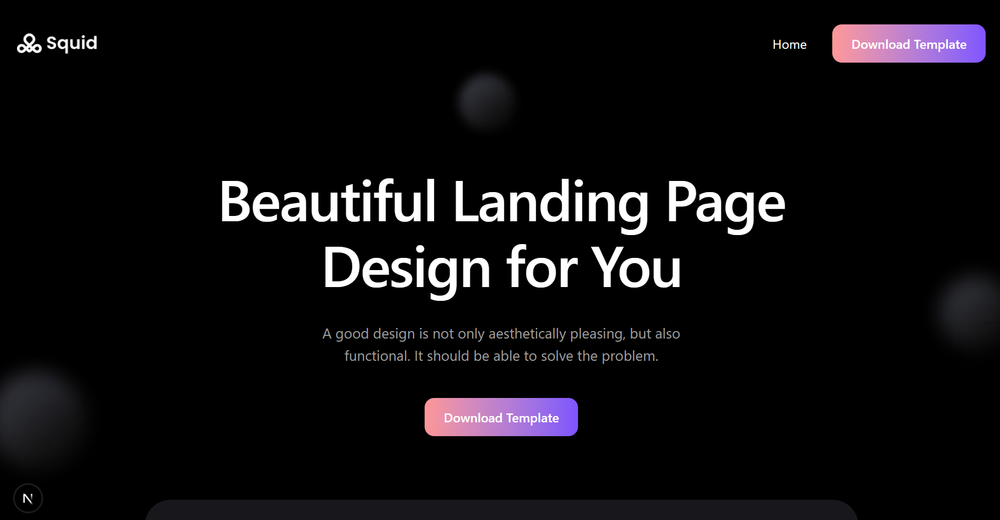
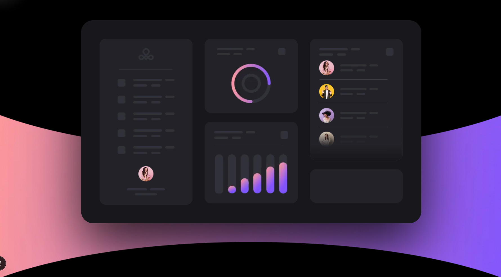
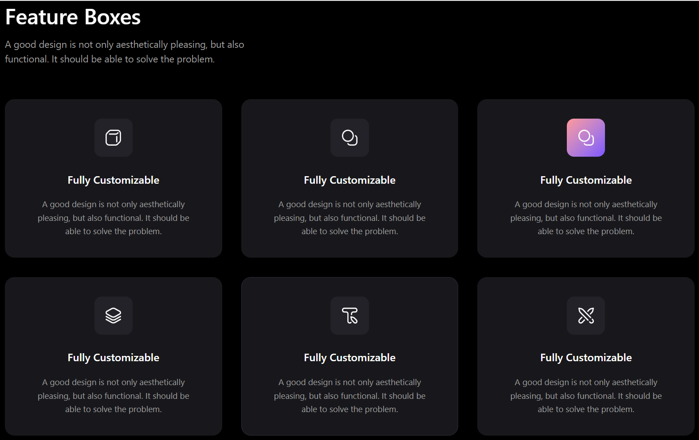
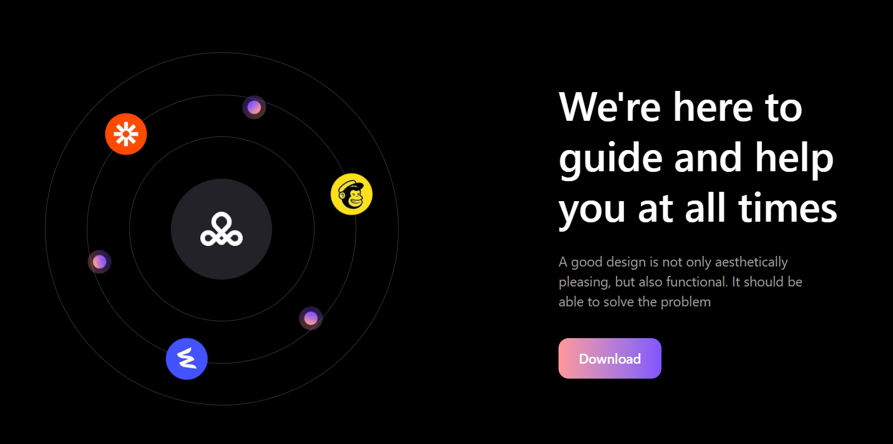
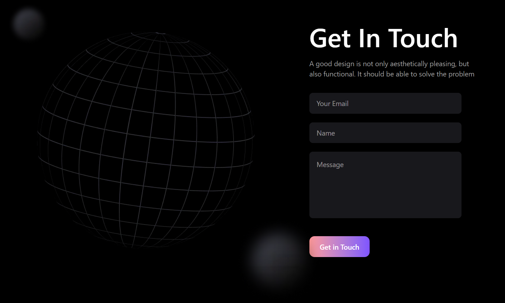
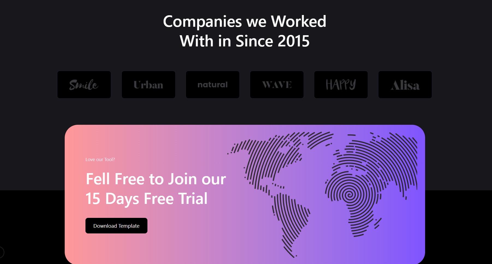
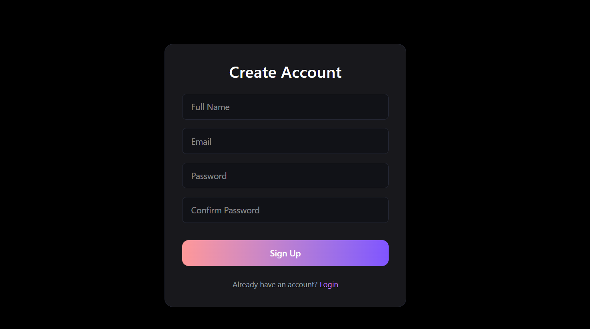
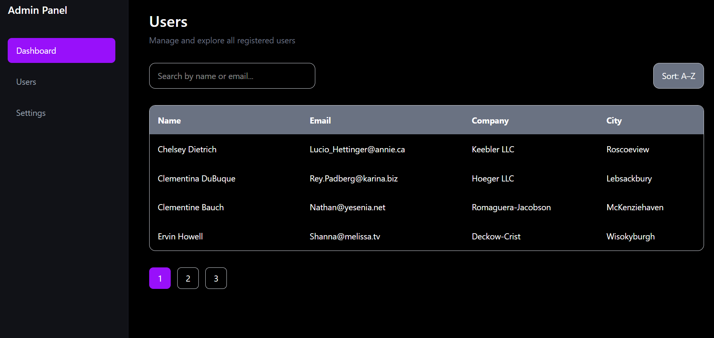
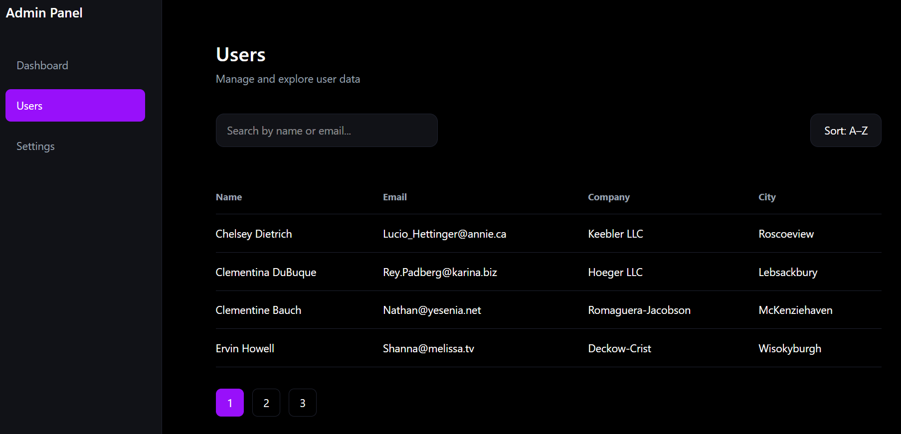
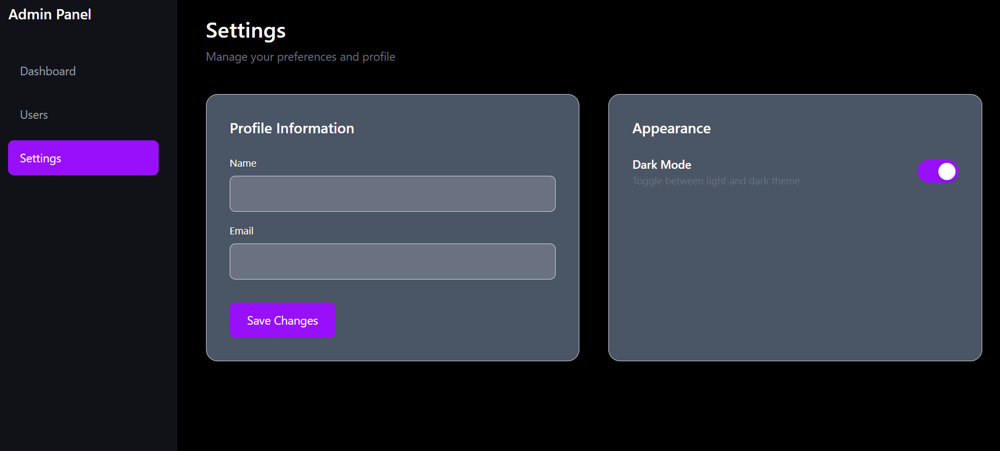

# SaaS Landing Page + Dashboard

Live Demo:
👉 **[https://saas-landing-dashboard-wine.vercel.app/](https://saas-landing-dashboard-wine.vercel.app/)**

---

## 📌 Project Overview

This project is a complete SaaS web application built using **Next.js + Tailwind CSS**.

It includes:

* Pixel-close Figma Landing Page
* Authentication (Login / Signup)
* Protected Dashboard
* API Integration (Users)
* Search, Sort, Pagination
* User Detail Modal
* Settings Page with Theme Toggle
* Responsive Layout

---

# Tech Stack

* **Next.js (App Router)**
* **Tailwind CSS**
* **TypeScript**
* JSONPlaceholder API
* LocalStorage (Fake Auth + Theme Persist)

---

# Part A — Landing Page (Figma Match)

The homepage is built to closely match the provided Figma design.













---

# Part B — Authentication

### Features

* Login Page
* Signup Page
* Fake authentication using localStorage
* Protected routes
* Logout clears token
* Redirect handling



---

# 📊 Part C — Dashboard (API Integration)

* `/dashboard` (Summary)
* `/dashboard/users`
* `/dashboard/settings`

### API Used

```
https://jsonplaceholder.typicode.com/users
```

---

## Dashboard Summary

* Total Users Count
* Unique Companies Count
* Unique Cities Count
* Loading & Error States handled



## Users Page

### Implemented Features

* List View (Table)
* Search by Name / Email
* Sort (A–Z / Z–A)
* Client-side Pagination
* User Detail Modal
* Empty State
* Loading State
* Error Handling



## Settings Page

### Features

* Profile Form
* Theme Toggle (Light / Dark)
* Persist theme in localStorage



---

# Project Structure

```
saas-landing-dashboard/
│
├── public/
│   └── icons/                     # All landing page & UI icons
├── src/
│   ├── app/
│   │   ├── layout.tsx             # Root layout (HTML, Poppins font, theme setup)
│   │   ├── globals.css            # Global styles + Tailwind config
│   │   ├── page.tsx               # Landing Page (Figma Homepage)
│   │   ├── login/                 # Login Page
│   │   ├── signup/                # Signup Page
│   │   ├── dashboard/             # Dashboard Sidebar Layout, # Dashboard Summary
│   │   │   ├── users/             # Users Page (Search, Sort, Pagination, Modal)
│   │   │   └── settings/          # Settings Page (Theme Toggle + Profile Form)
│   ├── components/
│   │   ├── ui/
│   │   │   ├── Button.tsx
│   │   │   ├── Spinner.tsx
│   │   │   ├── ErrorState.tsx
│   │   │   └── Input.tsx (Reusable input component)
│   │   ├── landing/
│   │   │   ├── Hero.tsx
│   │   │   ├── DashboardPreview.tsx
│   │   │   ├── FeatureBoxes.tsx
│   │   │   ├── OrbitSection.tsx
│   │   │   ├── CompaniesSection.tsx
│   │   │   ├── FreeTrialSection.tsx
│   │   │   ├── GetInTouchSection.tsx
│   │   │   └── Footer.tsx
│   │   └── ProtectedRoute.tsx     # Route protection logic
│   ├── hooks/
        ├── useUsers.ts            # API fetch logic (JSONPlaceholder)
        └── useTheme.ts            # Dark/Light theme persistence│

```

---

# Setup Instructions

Clone the repository:

```bash
git clone https://github.com/mounika281005/saas-landing-dashboard.git
```

Install dependencies:

```bash
npm install
```

Run development server:

```bash
npm run dev
```

Build for production:

```bash
npm run build
```
